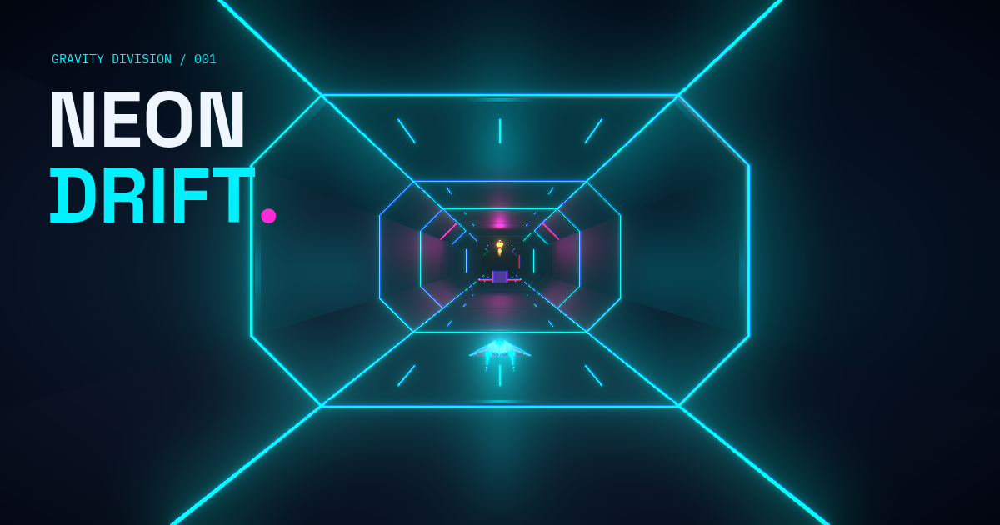
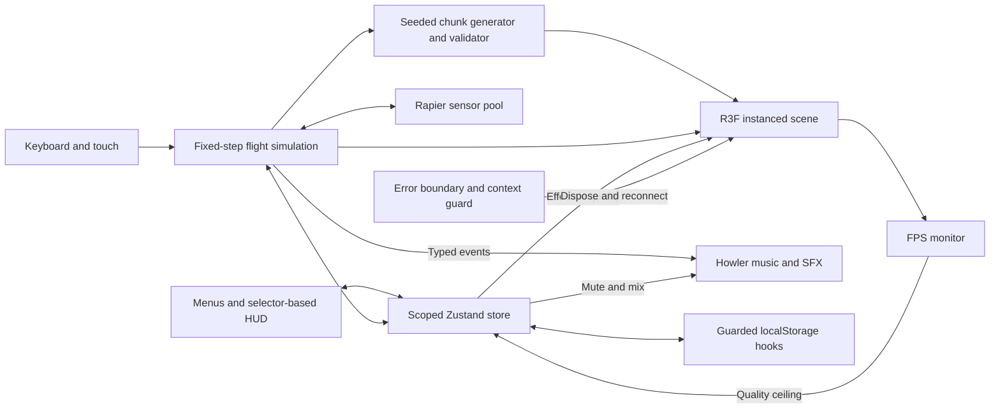

# NEON DRIFT

A full-bleed 3D gravity runner through a recycled neon conduit.

> **Hero GIF placeholder:** This gameplay still reserves the hero slot. Replace it with a short, muted GIF showing lane changes, a gravity flip, and an orb pickup before publishing the repository.



Phase 6 adds local playtest reports, three difficulty presets, gentle onboarding, an original arrowhead craft, and near-miss scoring. The game runs entirely in the browser, with local records and preferences, original synthesized audio, adaptive graphics, and Vercel-ready sharing assets. No account or backend is required. The author interview below is awaiting the developer's own answers.

## Install and Run

Use Node.js 22.18+ (Node.js 24 recommended), npm, and a WebGL2-capable browser with hardware acceleration.

```bash
npm ci
npm run dev
```

Open the local URL printed by Next.js. The default port is 3000; Next.js selects an available port if it is occupied.

```bash
npm test
npm run typecheck
npm run lint
npm run build
npm start
```

For another device on your network, run `npm run dev -- --hostname 0.0.0.0` and open your computer's LAN address with the printed port. No API keys or external asset services are required; fonts, geometry, physics, and audio are served locally.

## Controls

| Action | Keyboard | Touch |
| --- | --- | --- |
| Change lane | A / D or left / right arrow | Swipe left / right, or arrow buttons |
| Flip gravity | Space, W, or up arrow | Swipe up, or gravity button |
| Pause / resume | Esc or P | Pause / resume button |
| Mute / unmute | M | Speaker icon or Settings switch |
| Launch / retry / resume | Enter | Main action button |
| Return to menu | Focus and activate the home button | Home icon or NEON DRIFT wordmark |
| Close settings / leaderboard / report | Esc or Back | Back, close icon, or backdrop |
| Toggle playtest tools | Backtick | Open with `?debug=1` |
| Navigate menus | Tab / Shift+Tab, Enter / Space; arrows for presets/sliders | Tap controls |

Steering remains screen-relative on the ceiling. A flip takes 0.3 seconds, grants invulnerability during transit, and rotates the camera 180 degrees. Reduced motion uses an instantaneous camera orientation change instead of a continuous roll. Its start-to-start cooldown is 0.72 seconds. Holding a key does not queue repeated actions. Switching tabs or losing browser focus pauses the run. Native dialogs contain keyboard focus and prevent flight input while open; Escape closes the panel before it can resume a paused run.

## Features

- Three obstacle types: violet static blocks, magenta sweeping barriers, and red laser gates on the floor or ceiling.
- Seeded four-row chunks, generated ahead and recycled behind the craft. Full-surface laser rows require gravity flips.
- Gold energy orbs follow the reserved survivable route and award 10 energy exactly once per pickup.
- Six pooled chunks: 144 obstacle slots, 24 orb slots, and one player sensor. Meshes, collider bodies, and slot objects are reused, including on restart.
- Fixed-step Rapier sensor collisions at 60 Hz. Hits cost 25 shield and trigger camera shake, a screen flash, and a pooled particle burst.
- A 1.15-second damage recovery window prevents overlapping obstacles from draining the shield instantly. Four separated hits end a run.
- Smooth lane changes, a forward-arching flip, speed-driven FOV, custom craft geometry, emissive tunnel ribs, and pooled exhaust particles.
- Explicit low/medium/high graphics presets for postprocessing, resolution limits, particles, and speed lines. Phones initially use medium; a saved preference takes precedence.
- Automatic, session-only quality reductions after sustained frame rates below 45 FPS. The selected preset remains the quality ceiling; adaptive graphics can be disabled.
- Responsive telemetry, labeled controls, and animated launch/pause/restart states. No React state updates in the per-frame movement loop; telemetry publishes at 10 Hz.
- Animated score, a pulsing combo badge, shield health colors, speed readout, and a flip-cooldown ring, styled with Tailwind and Framer Motion. Instruments use narrow Zustand selectors independently of the scene.
- Distance points, banked orb bonuses, and close-pass bonuses, with a consecutive-orb multiplier up to x5. Hits break the combo without removing earned points.
- Chill, Normal, and Intense presets with a gentle 20-second opening, a flip opportunity at 4.5 seconds, and smooth time-based speed and spawn-density curves.
- A one-time flip hint and no hard patterns until the first completed flip. Already-visible obstacles never change when difficulty unlocks.
- A 16-facet swept arrowhead craft with emissive edges; exhaust changes from cyan to magenta to gold as combo rises.
- Rapier-measured near misses award points, a brief slow-motion edge flash, and a "CLOSE!" popup. Reduced motion keeps the bonus and static popup without the flash or slowdown.
- Hidden FPS/speed/difficulty/density/time instruments, a local last-50-run report, per-preset death statistics, JSON export, and optional mailto feedback.
- A localStorage personal best with validated reads, throttled writes, cross-tab merging, and an in-memory fallback when browser storage is unavailable.
- A slow-moving menu tunnel, drifting camera, breathing neon title, and animated Play, Settings, and Leaderboard controls.
- Pause and game-over score count-ups, a brief new-high-score celebration, and immediate Retry/Menu actions without recreating the scene or physics world.
- A local top-five completed-run leaderboard, sorted by score, with distance and peak combo. Abandoned runs are not submitted; the continuously tracked personal best can still include them.
- A native settings dialog with quality controls, master/music/effects sliders, and a reduced-motion switch that follows the system preference until overridden.
- A looping original synth track and separate collect, hit, flip, and game-over cues. First-interaction audio unlock, bounded effect voices, persistent mute, and independent volume controls.
- Automatic focus-loss pause, keyboard-accessible menus, and a friendly renderer-error fallback. Reconnect releases the failed scene and starts fresh at low quality while preserving records and preferences.
- Real drei loading progress for scene-module loading and physics-sensor readiness. Cached loads may finish almost immediately; no timed or simulated percentage is used.
- One shared palette/glow/font theme, notch/home-indicator safe areas, portrait/landscape dialogs, peripheral speed lines, and speed-dependent exhaust trails.

## Architecture



```text
app/                   App Router entry, metadata, and global styles
components/            Client shell, selector-based HUD, animated counters/menus
game/config.ts         Gameplay tuning and pool capacities
game/theme.ts          Shared palette, glow, fonts, and combo colors
game/difficulty.ts     Smooth speed/density curves and distance integration
game/patterns.ts        Seeded generator, validator, and chunk recycling
game/simulation.ts      Deterministic movement and the store/physics bridge
game/PhysicsWorld.tsx   Fixed Rapier sensor pool and overlap resolution
game/GameScene.tsx      Three.js scene and preset-controlled postprocessing
game/performance.ts    Sustained-FPS monitor and adaptation timing
game/audio.ts          Gesture-unlocked music, effect sprites, and cleanup
game/                  Instanced tunnel, obstacles, craft, and effects
hooks/                 Input, audio, high-score and profile lifecycles
hooks/usePlaytest.ts    Local run checkpoints, history, and debug toggle
store/gameStore.ts     Lifecycle, scoring, settings, panels, and local records
store/runHistory.ts    Run validation, death statistics, and feedback payloads
store/useGameStore.ts  Per-game provider and selector-only React hook
store/highScore.ts     Guarded storage adapter with session fallback
game/*.test.ts         Flight, difficulty, and generation regression tests
store/*.test.ts        Lifecycle, scoring, and storage regression tests
scripts/              Reproducible original audio and icon generators
public/               Local audio and 1200x630 Open Graph bitmap
```

Tech stack: Next.js App Router, React 19, TypeScript, Three.js, React Three Fiber, drei, react-three/postprocessing, Rapier via react-three/rapier, Zustand, Howler.js, Tailwind CSS, Framer Motion, and Lucide. Tests use Node's native test runner. Space Grotesk and IBM Plex Mono are bundled locally. All scene assets are custom procedural geometry.

Each game instance has one Zustand store. It owns `menu`, `playing`, `paused`, and `gameOver`, along with shield, scoring, combo, and the record. Typed actions reject invalid transitions; starting requires the physics scene to be ready. Start/retry and return-to-menu reset movement and pooled slots through the simulation's store subscription. The simulation reads lifecycle and shield values from that same store rather than maintaining a second state machine.

Rapier advances mutable movement and sensor positions together at 60 Hz. UI telemetry is published at 10 Hz and synchronously before pickups, hits, flips, and pauses, so the last fraction of a run is included in its score. The scene never subscribes to score, combo, or high score; the physics wrapper selects lifecycle status, and the scene selects only quality and reduced motion. Individual HUD instruments subscribe to the values they display. Counter animation uses motion values instead of per-frame React state.

Store actions contain no browser storage access or timers. Persistence runs in separate client hooks with cleanup, leaving lifecycle, scoring, preference validation, and leaderboard ranking testable without a browser. Completing a run records it once within the same store transition; retry reuses the existing pool immediately, independently of overlay exit animations.

The scene uses procedural geometry rather than downloaded models/textures. Its loader registers actual scene-code loading and completed Rapier sensor initialization with Three's `DefaultLoadingManager`; drei's `useProgress` reads completed work items from that manager. The loading screen blocks HUD input until the physics world is ready, then fades away. Its percentage measures completed initialization tasks, not estimated download bytes.

## Scoring and Records

- Distance earns 1 point per meter. Total score is the integer distance score plus accumulated orb and near-miss bonuses; the combo does not retroactively multiply distance or earlier points.
- Each orb awards `100 * combo` bonus points and 10 energy. Every third consecutive pickup increases the combo before awarding that pickup, up to x5. The first three bonuses are 100, 100, and 200; the sixth orb awards 300.
- A damaging hit resets combo to x1 and the streak to zero. Existing score is kept. An ignored hit during invulnerability does not break the combo. Missing an orb does not break it.
- A near miss awards `50 * combo` after fully passing an obstacle with 0.02-0.24 m of collider-surface clearance. Rapier measures the closest gap while alongside it. Contact, flip invulnerability, damage recovery, and already-spent obstacles cannot earn a bonus. Each pooled obstacle generation pays at most once, with a 1.2-second active-time cooldown between awards.
- A close pass briefly slows movement, barrier phase, flips, and particles to 0.45x for 0.18 active seconds, with a single edge flash and a 0.75-second "CLOSE!" popup. Reduced motion disables slowdown and flash, not the score. Pause freezes the slowdown and clears the popup.
- Pause freezes movement, score, difficulty, and cooldown. Resume continues the same run. Retry/menu reset run values but preserve the personal best.
- The personal best uses `neon-drift.high-score.v1` in localStorage. Writes are throttled to once per second and flushed on pause, game over, menu, page hide, or unmount. Corrupt, negative, fractional, or unsafe values are ignored, and records never decrease.
- If localStorage is blocked or full, gameplay continues with an in-memory record for the current session. Such a fallback cannot survive closing or reloading the page.
- Settings and completed runs use `neon-drift.profile.v1`. Invalid preference values and records are rejected, volume values are clamped, and only the top five valid results are retained. Preference writes are debounced; completed results are written immediately. Storage failures leave the current page's preferences and records usable in memory.

## Playtest Tools

Press backtick or open `/?debug=1`. The hidden readout shows measured FPS, current m/s, continuous-curve difficulty mapped to levels 1-10, configured spawn-density probability, and active time alive. The report icon pauses a live run and opens **Run Report**. Backtick ignores editable fields and modifier shortcuts; hiding debug also closes its report. These tools work in production without exposing development-only simulation handles.

Run history lives only in `neon-drift.runs.v1` in this browser. The latest 50 validated runs are kept by end time, independently of the top-five leaderboard. Each record includes an ID, end timestamp, active duration, simulation time, difficulty preset, score, maximum combo, orb count, completed flips, near misses, and ending (`death`, `finished`, `abandoned`, or `interrupted`). Deaths also include obstacle type, logical chunk index, distance, and craft position; Z is absolute track position rather than the recycled display coordinate.

Active duration counts unpaused fixed-step time, including the full near-miss slowdown interval. Simulation time advances more slowly during that interval and drives difficulty, movement, and cooldowns. History checkpoints are written at most once per second during a run and flushed on lifecycle/page-hide events. Reloading recovers an active checkpoint as interrupted; completing that run replaces its checkpoint rather than duplicating it. An abrupt browser/process crash can lose the latest interval. Blocked/full/corrupt storage does not stop gameplay; the report shows session-only storage when writes are unavailable.

The report defaults to Normal and can filter each preset or all runs. Average survival, ranked obstacle death causes, and death-time buckets (0-10, 10-20, 20-30, 30-45, 45-60, 60-90, and 90+ seconds) include **deaths only**. Abandoned/interrupted/finished records remain inspectable but are not treated as deaths. JSON export always includes all retained records, not just the filter, with a schema version and export timestamp. No data is uploaded automatically.

For feedback, set `GAME_CONFIG.playtest.feedbackEmail` in [game/config.ts](game/config.ts), then enable the optional in-game feedback link in Settings. The report also has a feedback link. It opens the player's mail app with the latest completed run's statistics and space for their notes; sending remains the player's decision. The default address is intentionally empty and requires the player to choose a recipient.

## Difficulty Tuning

All gameplay values are in [game/config.ts](game/config.ts). Change `DIFFICULTY_PRESETS` to tune the three modes without modifying the curve or generator. A setting applies to the **next run**; changing it while paused does not alter the current run.

| Config value | Chill | Normal | Intense | Meaning and tuning intent |
| --- | --- | --- | --- | --- |
| `initialSpeed` | 14 | 16 | 19 | m/s at launch; slower starts give time to recognize lanes and controls. |
| `cruiseSpeed` | 20 | 24 | 28 | m/s after the gentle 20-second smoothstep opening. |
| `maximumSpeed` | 32 | 40 | 46 | Asymptotic m/s ceiling; also the validator's conservative speed. |
| `initialDensity` | 0.12 | 0.16 | 0.22 | Starting per-eligible-cell obstacle probability. Onboarding overrides hard rows. |
| `cruiseDensity` | 0.28 | 0.40 | 0.52 | Probability reached at 20 seconds. |
| `maximumDensity` | 0.62 | 0.82 | 0.90 | Late-run probability ceiling; the reserved route is still cleared. |
| `timeConstant` | 75 | 45 | 30 | Seconds after onboarding to cover about 63% of the remaining speed/density gap; larger is gentler. |
| `rowSpacing` | 40 | 36 | 34 | Meters between rows; at maximum speed this gives 1.25 / 0.90 / 0.74 seconds between rows. |
| `gateEvery` | 6 | 5 | 4 | Hard-pattern row cycle; a larger value spaces mandatory flip gates farther apart. |
| `barrierFrequency` | 1.0 | 1.2 | 1.4 | Sweeping-barrier angular frequency in radians/second; slower sweeps are easier to read. |

The first 20 simulation seconds smoothly blend the initial and cruise values. Afterward, an exponential curve approaches the maximum values without discrete speed jumps. Distance is the exact integral of speed; rows sample density at their predicted arrival time, not generation time. Density is a generation probability, not a measured percentage of occupied track: safe routes, onboarding, gates, and recovery rows override it.

`onboarding.firstFlipAt = 4.5` puts a floor-center block and a ceiling orb within the first five seconds for every preset. Side lanes stay open, so this teaches a flip without requiring one. The hint appears after two seconds and disappears only after the first completed flip. Until both 20 seconds have elapsed and a flip has completed, rows contain only sparse, readable floor blocks (`easyBlockEvery = 4`), with no laser gates or moving barriers. Unlocking regenerates only chunks beyond the visible horizon; a visible row never changes underneath the player.

**Normal's new-player survival target is 30-45 seconds, not a measured result.** Gather first-attempt deaths from new players, review the Normal average and time buckets, and retain abandoned/interrupted counts when judging the sample. Death-only averages exclude players who quit or survive a test and can be biased. If deaths cluster before 20 seconds, lower `initialSpeed`/`cruiseSpeed` or increase `rowSpacing`; if players routinely survive far beyond the target after learning a flip, adjust `cruiseDensity` or `timeConstant` in small steps. Compare fresh runs on the same preset, not mixed experience levels.

## Pattern Review

The high-speed review flagged and changed these patterns:

| Risk | Applied fix |
| --- | --- |
| A mandatory flip combined with lateral movement was difficult to read at speed. | Gates keep the preceding lane and clear the entire landing surface. |
| Multiple sweeping barriers could visually overlap and close a route between samples. | At most one moving barrier per row, slower preset-specific sweeps, and validation against its entire swept volume. |
| Consecutive demands left too little time to recover after a gate. | A sparse recovery row follows each gate; generated routes move at most one lane per row. |
| Early hard patterns appeared before the player had learned a flip. | The 20-second/completed-flip gate above, with no mutations to visible chunks. |
| Thin lasers and a larger craft reduced readable clearance. | Stronger laser opacity, a collider containing the new craft, and a 0.22-second reaction margin plus 0.2 m clearance in route validation. |

The independent validator searches all six lane/surface cells using maximum speed, lateral travel, flip duration, cooldown history, reaction time, and hitbox clearance. It carries route state across chunk boundaries, treats lasers as continuously dangerous, and never relies on invulnerability. An invalid chunk becomes an empty recovery corridor using the same pool. The guarantee is a reachable path from the reserved entry, not survival after every arbitrary player choice. Orbs mark the reserved path.

## Visual Theme

[game/theme.ts](game/theme.ts) is the shared source for renderer/UI colors, glow strengths, lighting, font choices, and combo thresholds. Its palette is background `#070B1A`, primary `#00F0FF`, secondary `#FF2BD6`, accent `#7B2FFF`, and orb gold `#FFC857`. The layout exposes the same values as CSS variables; Three.js materials read the same theme. Changing to an unbundled font also requires installing/importing its files in [app/layout.tsx](app/layout.tsx).

The craft is original low-poly geometry: 16 angular facets with emissive edge lines, a swept arrowhead silhouette, and two engines. Engine/trail colors are cyan at x1-x2, magenta at x3-x4, and gold at x5. Geometry tests check the silhouette against the collision bounds. Icons and the Open Graph bitmap use the same visual identity; regenerate or recapture those static images after changing the theme.

## Graphics and Motion

| Preset | Particle draw budget | Speed lines | DPR cap | Postprocessing |
| --- | --- | --- | --- | --- |
| Low | 16 | 0 | 1 | Off |
| Medium | 40 | 20 | 1.25 | Lighter bloom and vignette |
| High | 72 | 36 | 1.5 | Full bloom, vignette, subtle chromatic aberration |

Effects reuse fixed instance buffers instead of allocating entities when presets change. Speed lines fade in above 29 m/s; exhaust stretches and the FOV widens smoothly at high speed. The menu tunnel moves at 3.5 m/s with a gentle camera drift. A pause freezes the camera and flight effects as well as the simulation.

Adaptive quality measures real frame time in one-second windows after a two-second warm-up. Three consecutive windows below 45 FPS lower high to medium, then medium to low if necessary. Each reduction gets a three-second settling period. Hidden, paused, game-over, and settings-panel time do not count. Healthy windows reset the low-FPS streak; quality does not automatically rise and oscillate. Selecting a preset or toggling adaptation resets the cap. The cap is not persisted, but the user's preset and adaptive preference are.

Reduced motion disables menu drift/travel, neon breathing, decorative particles, speed lines, FOV changes, damage shake/flash, pulsing and count-up animations, plus near-miss slowdown/flash. Movement and hit rules otherwise stay the same; camera orientation snaps at the flip midpoint so ceiling steering stays screen-relative without a spinning view. Reset settings restores automatic system motion preference.

The HUD and menus consume the shared theme and safe-area variables in [app/globals.css](app/globals.css). Short viewports hide duplicate live instruments while menus are open; they reappear during play. Short desktop result headings use one line, and landscape panels use two columns where practical. Settings scroll internally when height is limited.

## Audio

The first trusted pointer release or key press creates the two Howler banks and resumes the browser audio context. Nothing attempts audible autoplay before a gesture. Music resumes the same loop after pausing, muting, or losing focus; effect playback is limited to eight concurrent voices. The banks and listeners are unloaded when the flight session unmounts, including renderer failure. Audio load or unlock failure does not block gameplay.

The 16-second music loop and four-effect sprite are original, deterministic synthesis, with no external recordings. Both are mono 22,050 Hz WAV files, about 842 KB combined. Assets are committed; regeneration is optional:

```bash
npm run assets:audio
npm run assets:branding
```

Tune the composition in [scripts/generate-audio.ts](scripts/generate-audio.ts), and gains/sprite timings in [game/config.ts](game/config.ts). Master, music, effects, and mute preferences persist. Music plays more quietly in menus and results, pauses with a run or background tab, and resumes only when allowed by the browser. Listen on headphones and phone speakers before publishing; playback tests cannot judge the mix.

## Credits and License Notes

| Asset | Source and credit | License notes |
| --- | --- | --- |
| Craft hull/edges, tunnel, obstacle frames, orbs, shields, particles, speed lines | Original procedural geometry/materials in [game/geometry.ts](game/geometry.ts), [game/Player.tsx](game/Player.tsx), [game/Tunnel.tsx](game/Tunnel.tsx), [game/ObstacleField.tsx](game/ObstacleField.tsx), and [game/FlightEffects.tsx](game/FlightEffects.tsx). | Created for this project; no downloaded model, texture, stock image, or external scene asset. Project license is not yet selected. |
| App/touch icons and share image | Project-generated icons from [scripts/generate-branding.ts](scripts/generate-branding.ts); [public/og-image.png](public/og-image.png) is a capture/composite of the actual game. | Project-created artwork; the share image also uses the credited fonts below. Project license is not yet selected. |
| UI symbols, including the header mark and tool buttons | Lucide Icons and Contributors; some symbols derive from Feather by Cole Bemis. | ISC; Feather-derived icons retain MIT notices. Full notices are bundled below. |
| Space Grotesk display font | Copyright 2020 The Space Grotesk Project Authors; bundled through `@fontsource/space-grotesk`. | SIL Open Font License 1.1. Unmodified self-hosted webfonts; retain the copyright and OFL when redistributing. |
| IBM Plex Mono instrument font | Copyright 2017 IBM Corp.; bundled through `@fontsource/ibm-plex-mono`. | SIL Open Font License 1.1. Unmodified self-hosted webfonts; retain the copyright and OFL when redistributing. |
| Music loop | Original deterministic synthesis in [scripts/generate-audio.ts](scripts/generate-audio.ts), rendered as the committed local music WAV. | No samples, external recordings, or third-party music. Project license is not yet selected. |
| Collect, hit, flip, and game-over sounds | Four original synthesized cues in the same script, rendered as the local effects-sprite WAV. Near misses add no external sound. | No third-party samples. Project license is not yet selected. |

[public/third-party-notices.txt](public/third-party-notices.txt) ships the font and icon license texts and attribution with the app. Runtime/tool dependencies retain their own package licenses; for example, Rapier's bundled physics/WASM is Apache-2.0. Keep package license notices when redistributing dependencies.

There is currently **no project-level LICENSE file**. These credits do not grant a new license to the application or its original assets. Choose the intended project license before inviting reuse or publishing a licensed release; third-party fonts and icons remain under their own licenses regardless of that choice.

## Author Interview

Awaiting the developer's answers. No first-person technical-challenges narrative has been written for this phase. Answer in your own words, including where assistance was involved; a later draft should preserve that wording and distinguish your decisions from generated implementation.

1. **Pooled chunks and collision lifetime:** How did you decide what to reuse across chunks and retries? What first revealed a missed or duplicate collision when a sensor remained overlapping? What would you change about the pool or collision lifecycle now?
2. **Gravity flips and controls:** How did you choose the flip arc, camera rotation, and screen-relative steering? What felt wrong in the first version, especially on the ceiling or touch controls? What would you change for accessibility or input feel?
3. **Fair routes at high speed:** How did you decide which cooldowns, swept barriers, and reaction margins the validator needed? Which pattern first looked valid in code but felt unfair to play? What would you tune differently after new-player feedback?
4. **Rendering and resource ownership:** How did you separate fast simulation updates from the HUD and choose quality budgets? Which performance or cleanup problem did you encounter first, and what measurement exposed it? What would you profile or structure differently next time?
5. **Near misses and playtest evidence:** How did you decide when a close pass deserved points and how slowdown should affect run duration? What went wrong first with collision exclusions, repeated awards, or persistence? What would you change after comparing reports with what players say?

## Performance Audit

Phase 5 development-browser baseline at 1280x800 and device scale 1, retained as historical measurements rather than Phase 6 resource counts or a frame-rate guarantee:

| Check | Observed result |
| --- | --- |
| Initial high-quality frame | 35 draw calls, 9,967 submitted triangles |
| Visible-instance packing | Reduced the same initial frame from 81,803 triangles |
| 20 restarts / 480 simulated seconds | Same 26 mesh identities, 169 bodies and 169 colliders; 23 geometries and 12 textures remained stable |
| 15 score updates | 15 DOM commits, zero R3F commits |
| Controlled slow-frame test | High -> medium -> low, retaining the saved high-quality preference |
| Context-loss teardown | All 24 inventoried geometries and 26 materials disposed; audio unloaded; simulation event listeners dropped to zero |
| Reconnect | Fresh 169-body world, low quality, retained personal best, no page errors |

Automated tests now sweep 9,216 seeded chunks across all three presets at their maximum speeds, alongside movement/collision lifecycle, onboarding locks, scoring, near-miss exclusions/timing, run-history validation, storage failures, preference validation, geometry bounds, audio lifecycle/voice limits, generated WAV signal, and adaptive-quality timing. Run `npm test` for the current test count.

Earlier browser checks covered real sensor collisions, loading, persistence, focus containment/restoration, pause on blur, touch input, and nonblank scene pixels, including 320x568, 390x844, 844x390, 941x588, 1024x640, and 1440x900 layouts. Phase 6's controlled Rapier check measured a 0.12 m close pass: 50 bonus points, no damage, and 0.45x slowdown. A direct collision awarded no near-miss points. These fixtures verify implementation, not human difficulty or subjective readability; repeat sustained playtests on target devices.

In development only, `canvas.__performance` exposes sampled FPS, whole-frame draw calls/triangles, resource counts, and quality reductions. `canvas.__neon`, `canvas.__renderer`, `canvas.__scene`, `canvas.__camera`, `canvas.__physicsWorld`, and `main.__audio` support controlled diagnostics. They are absent from production. Resource counts are a bounded-resource audit, not proof against every possible browser/driver heap leak; profile a long session on target hardware before release.

## Deploy to Vercel

1. Import this repository into Vercel with the **Next.js** framework and the repository root as the project directory. Choose Node.js **24.x**. [vercel.json](vercel.json) sets `npm ci` and `npm run build`; leave the output directory at the framework default. Do not configure a static export or custom server.
2. Set `NEXT_PUBLIC_SITE_URL` to your canonical absolute HTTPS origin in project environment settings, then rebuild. [.env.example](.env.example) documents the optional local value. Without it, metadata falls back to `VERCEL_PROJECT_PRODUCTION_URL`, then `VERCEL_URL`, then `http://localhost:3000` locally. No secrets are needed.
3. Review the title, description, canonical URL, Open Graph, and Twitter card in [app/layout.tsx](app/layout.tsx). [public/og-image.png](public/og-image.png) is the committed 1200x630 share bitmap. [app/icon.png](app/icon.png) is the favicon and [app/apple-icon.png](app/apple-icon.png) is the touch icon; regenerate their mark through [scripts/generate-branding.ts](scripts/generate-branding.ts).
4. Deploy a preview and test its actual HTTPS URL. `VERCEL_ENV=preview` marks previews `noindex, nofollow`; production remains indexable. Vercel deployment protection must permit your intended testers or share crawlers to access the page. The production canonical URL should still point at your chosen public domain.
5. Verify the initial HTML's absolute share-image URL and fetch the image, icons, and audio assets without authentication. Test the final URL in the sharing platforms you use, refreshing cached cards after image changes.

The Next.js configuration enables strict mode, removes the framework header, and supplies `nosniff` and a conservative referrer policy. Fonts, sound, and images are self-hosted. No remote deployment is performed by the setup scripts. Changing build-time metadata environment variables requires a new build.

Records are local to a browser profile, editable by the player, and not a competitive online leaderboard. There is no account sync, anti-cheat backend, or guaranteed persistence when browser storage is blocked or cleared.

## Before Publishing

- [ ] Run `npm test`, `npm run typecheck`, `npm run lint`, and `npm run build`; smoke-test `npm start`.
- [ ] Listen to the music loop and all four cues on desktop and phone speakers. Check first-interaction playback, volume sliders, M/mute persistence, pause, background/resume, and retry without duplicate music.
- [ ] Play a sustained run on a low-powered phone/GPU. Check automatic reductions, each manual preset, reduced motion, battery/thermal behavior, and long-session memory in browser developer tools.
- [ ] Navigate Play, Settings, Leaderboard, pause, and results using only the keyboard. Check dialog focus, Escape, sliders, auto-pause on tab/focus loss, and the reconnect fallback after context loss.
- [ ] Test portrait/landscape, small and notched phones, native swipe-then-button input, readable HUD/results, and scrollable settings without page scrolling.
- [ ] Verify score/combo/hit rules, cooldown, safe routes, completed-run ranking, reload persistence, and graceful operation with denied/corrupt localStorage.
- [ ] Test all three difficulty presets, the first-five-seconds flip opportunity, hint dismissal, and no hard patterns before a completed flip. Collect first-attempt Normal runs to assess the 30-45 second target.
- [ ] Check backtick/`?debug=1`, preset report filters, death buckets, last-50 retention, interrupted checkpoints, JSON export, and feedback with the intended email recipient.
- [ ] Check close passes versus actual collisions, no awards during invulnerability, combo-colored exhaust, and near-miss pause/retry/reduced-motion behavior.
- [ ] Answer the author interview before drafting personal technical-challenges prose; choose a project license and retain the third-party notices.
- [ ] Replace the hero GIF placeholder, choose the public domain, and customize the title, description, share bitmap, icon, audio mix, and gameplay tuning as needed.
- [ ] Verify a Vercel HTTPS preview and the final public share card. Check canonical URLs, indexing, static assets, and any deployment-protection settings before publishing.
